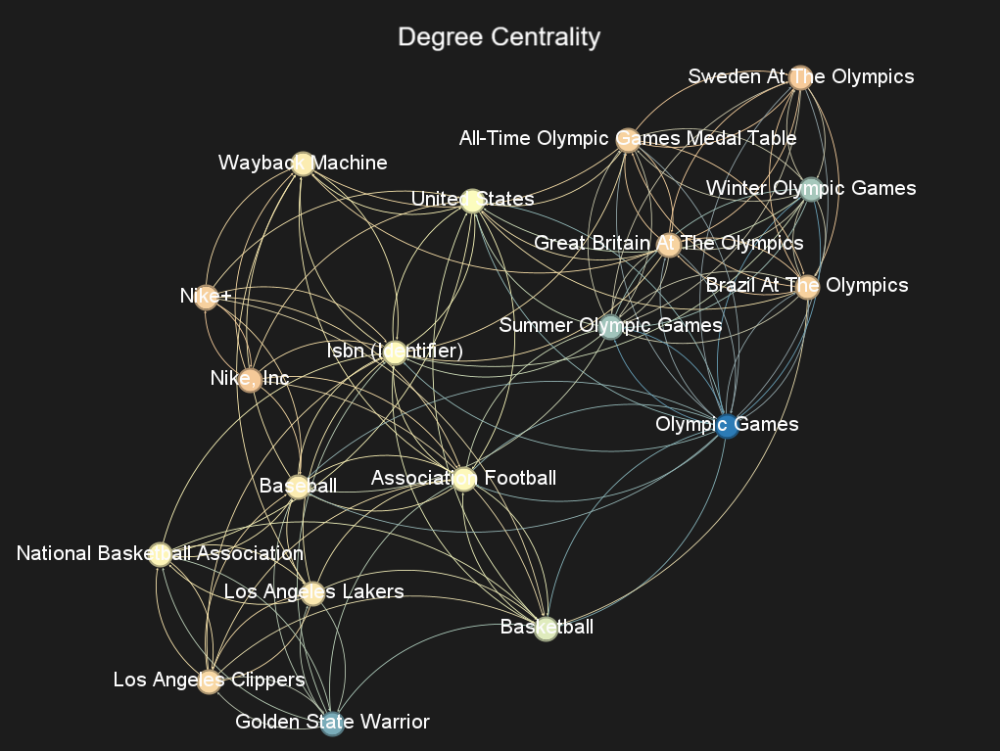
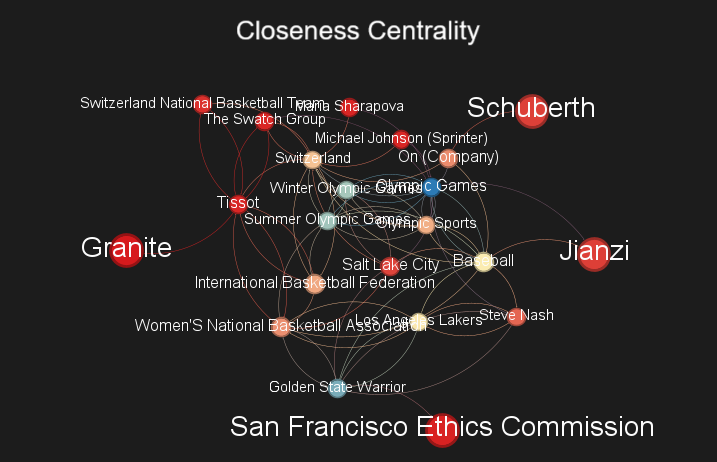
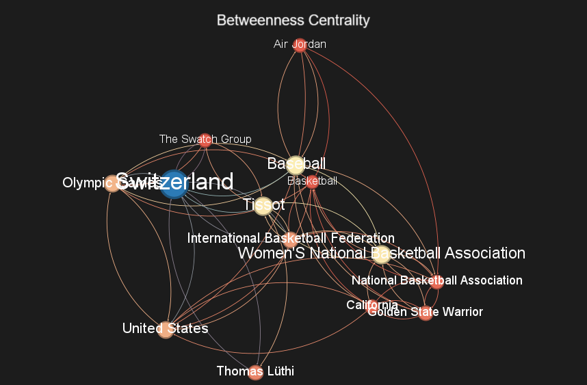
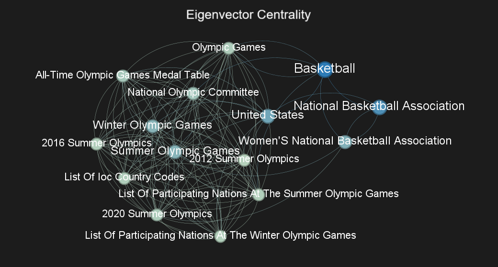
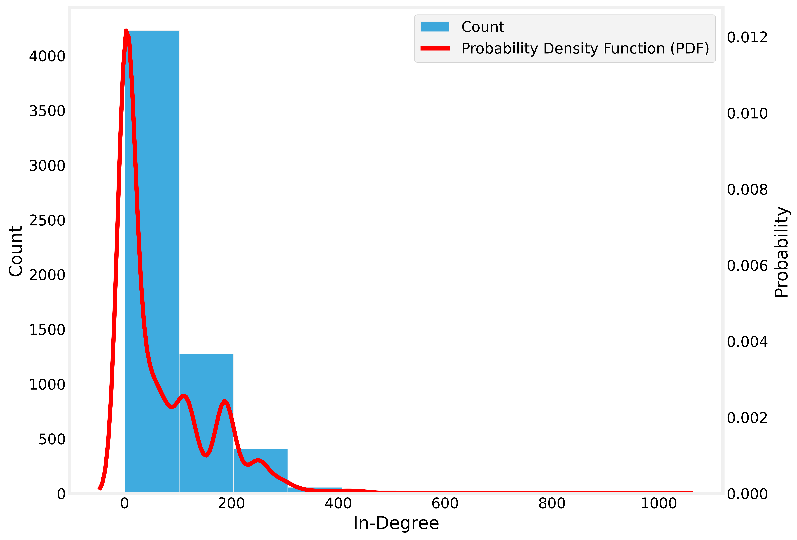
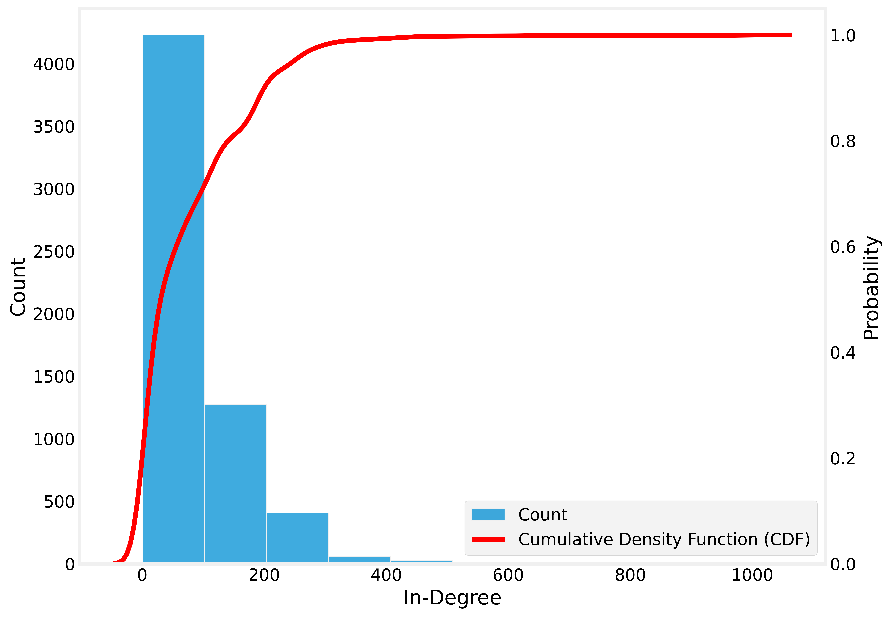
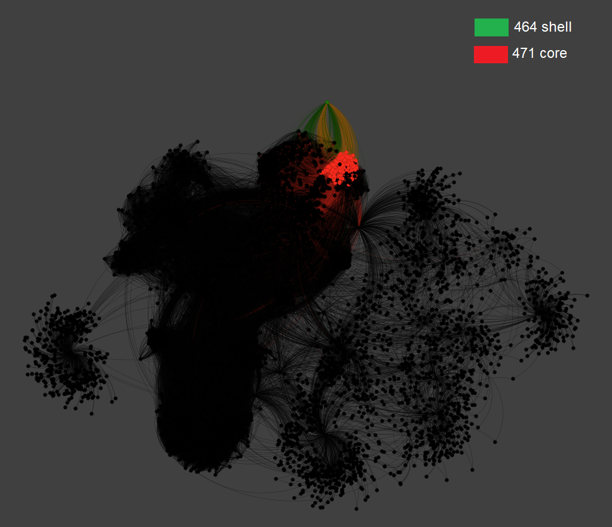

# U2T3
## Componentes: Ivamar Dantas Roque e Paulo Ricardo Dantas
O trabalho 3 da segunda unidade tem como objetivos aplicar os conhecimentos das semanas 10, 11 e 12, que são:
- Excentricidade, Diametro, Periferia, Raio e Centralidade
- *Degree, Closeness, Betweenness and Eigenvector Centrality*
- *Centrality Distributions*
- *Core Decomposition*
- Biblioteca wikipedia para criação de redes dirigidas
- Introdução a ferramenta Gephi

O trabalho basicamente vai ser escolher 4 sementes (páginas da wikipedia) fazer um rede dirigida para cada uma das sementes e depois mesclar essas redes. 

## Divisão do trabalho
- Requisito 01: 
    - Gerar uma rede (grafo) dirigida a partir dos links das páginas do Wikipédia
considerando a fusão de 4 SEEDs (páginas iniciais)
    - As SEEDs deverão ser diferentes daquela fornecida no exemplo da semana 11.
Limitar o nível de profundidade da rede para 2 (similar ao que foi demonstrado
em sala de aula). 

- Requisito 02: A partir da rede construída gerar uma figura similar utilizando o Gephi. Adote um layout que seja razoável perceber a diferença entre as cores do vértices. As figuras devem ser acompanhadas de descrições/explicações.

- Requisito 03: A partir da rede construída gerar uma figura similar considerando o in-Degree dos
vértices da rede. A figura deverá ser acompanhada de explicações/descrições.

- Requisito 04: A partir da rede construída gerar uma figura similar no gephi destacando o k-core e o k-shell da rede. O layout é de livre escolha. Os vértices devem ter um tamanho
proporcional a propriedade in-degree. A figura deverá estar acompanhada de descrição/explicação.

- Requisito 05: A rede deverá estar em produção de forma análoga ao explicado na Semana 12. As cores deverão ser relacionadas ao critério de comunidade e o tamanho do vértice a métrica in-degree. 

# Resolução do trabalho
## Requisito 1
A primeira parte da resolução é escolher as 4 páginas da wikipedia que vão ser usadas para gerar as redes. As páginas foram escolhidas com um critério base, para que elas tenham uma ligação, mas não diretamente.

As redes escolhidas foram: Golden State Warriors, Olympic Games, Nike Inc e Tissot. Na tabela a seguir vão ser disponibilizados os links como referência.

| Página | Link | 
|------|------|
| Golden State Warriors | https://en.wikipedia.org/wiki/Golden_State_Warriors |
| Olympic Games  | https://en.wikipedia.org/wiki/Olympic_Games |
| Nike, Inc. | https://en.wikipedia.org/wiki/Nike,_Inc. |
| Tissot | https://en.wikipedia.org/wiki/Tissot |

Para transformar essas páginas em redes, foi utilizado a biblioteca da wikipedia. O código utilizado foi o [U2T3_Requisito_1.ipynb](https://github.com/rikdantas/Algoritmos-Estruturas-Dados-II/blob/main/U2T3/source/U2T3_Requisito_1.ipynb). Porém a execução desse código é demorado, tendo células que demoraram cerca de 50 minutos para executar, então foram baixados os arquivos graphml resultantes desse notebook, e foram upados em um drive, para que se alguém for reproduzir esse repositório, não precise rodar novamente o notebook por horas. 

O notebook [U2T3_Compose.ipynb](https://github.com/rikdantas/Algoritmos-Estruturas-Dados-II/blob/main/U2T3/source/U2T3_Compose.ipynb) importa as 4 redes e usa o método compose da biblioteca networkx para uní-las em apenas uma (*fgraph.graphml*). Note que a quantidade de nós da rede final não é exatamente a soma da quantidade de nós de cada uma das redes, isso devido ao fato que entre essas redes existem alguns nós e arestas que são comuns, que é uma das finalidades desse trabalho, achar nós e arestas comuns em diferentes redes. As redes resultantes podem ser encontradas nesse [link](https://drive.google.com/drive/folders/1Q_kZAwqZ8u2u9eWlB67fhz2Qq-nbzjLf?usp=drive_link).

## Requisito 2
Nesse requisito é pedido que sejam geradas 4 imagens usando o gephi, aonde elas vão estar coloridas conforme algum atributo. Os atributos são *Degree, Closeness, Betweenness* e *Eigenvector*. Como a rede ficou muito grande (cerca de 8000 nós), a imagem iria ficar com a visualização muito prejudicada, então para cada atributo foram filtradas apenas os nós que tinha o maior valor de cada atributo para aparecer nas imagens.

A paleta de cores usada foi a da imagem a seguir, aonde quanto mais vermelho, menor o valor do atributo e quanto mais azul, maior o valor do atributo.

### Degree Centrality

O *Degree Centrality* basicamente é a métrica que conta o número de conexões do nó. Lembre que para como nossa rede é uma rede dirigida, essa métrica é a soma do *in-degree* e *out-degree*, que seriam as conexões de entrada e de saída do nó. Como podemos ver na imagem acima, o nó que possui maior grau é o nó *Olympic Games*.

### Closeness Centrality

O *Closeness Centrality* é a distância média de um nó para os outros nós. Em outras palavras seria o quão perto um nó está dos outros. Como podemos ver na imagem, o nó com a maior distância média também foi o *Olympic Games*.

### Betweenness Centrality

O *Betweenness Centrality* mede o menor caminho entre um nó e outro na rede. É importante falar que quanto maior essa métrica for, maior será a chance do nó ser um nó ponte, que seria que passa um tráfego muito grande por ele. Para a nossa rede, o nó com maior *betwenness* foi o nó *Switzerland*.

### Eigenvector Centrality

O *Eigenvector Centrality*, que também pode ser traduzido como autovalor, mede o quão um nó possui vizinhos importantes. Para a nossa rede, o nó com maior autovalor foi o nó *Basketball*.

## Requisito 3

Para acessar o notebook em que o requisito 3 foi desenvolvido basta clicar nesse [link](https://github.com/rikdantas/Algoritmos-Estruturas-Dados-II/blob/main/U2T3/source/U2T3_Requisito_3.ipynb).
### Probability Density Function

A Probability Density Function (PDF) é uma função matemática usada na computação e análise de dados para descrever a probabilidade de uma variável aleatória contínua assumir diferentes valores. Ela mostra como a probabilidade está distribuída ao longo dos possíveis resultados. A integral da PDF em um intervalo fornece a probabilidade de a variável assumir um valor nesse intervalo. Em resumo, a PDF é essencial para modelar e entender a distribuição de probabilidade em dados contínuos, sendo útil em áreas como aprendizado de máquina e estatísticas.

Note que a linha vermelha não passa exatamente nas barras plotadas do histograma, isso se deve a variação do eixo x não ser pequena o suficiente para mostrar todos os valores do histograma.

### Cumulative Density Function

A Cumulative Distribution Function (CDF) é uma função que mostra a probabilidade acumulativa de uma variável aleatória ser menor ou igual a um valor específico. Ela ajuda a entender como a probabilidade se acumula ao longo de uma escala de valores, sendo útil para calcular percentis e avaliar a probabilidade de eventos até certo ponto. Em resumo, a CDF complementa a Probability Density Function (PDF) ao fornecer uma visão acumulativa da distribuição de probabilidade. 

## Requisito 4

Para realização do requisito 4, foi necessário o auxílio da biblioteca networkx, para que fosse encontrado os k-core e o k-shell. Para acessar basta clicar [aqui](https://github.com/rikdantas/Algoritmos-Estruturas-Dados-II/blob/main/U2T3/source/U2T3_Requisito_4.ipynb). Com o k-core em mãos foi utilizado o gephi para colorir os nós. 

Falando um pouco sobre a nossa rede, como a nossa rede é muito grande, existem muitos nós com uma disparidade muito grande de grau. Isso se reflete no gráfico plotado, 464 shell possui apenas um nó e para destacá-lo foi necessário puxar ele para mais longe. 

# [Link do vídeo](https://www.loom.com/share/f5c53fa67a7e4c62818bfc4a04df9b47?sid=b4d7ae68-aad7-4dbd-a535-6eeed83bb22d)