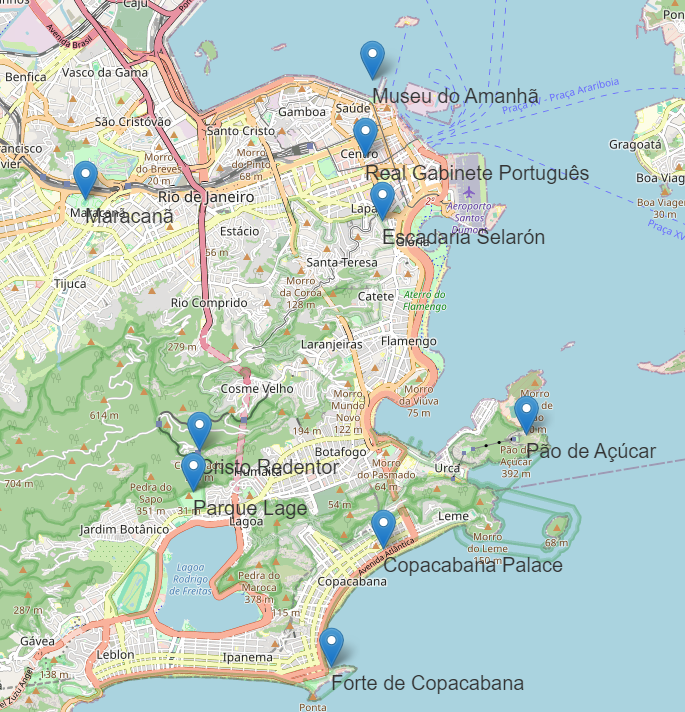
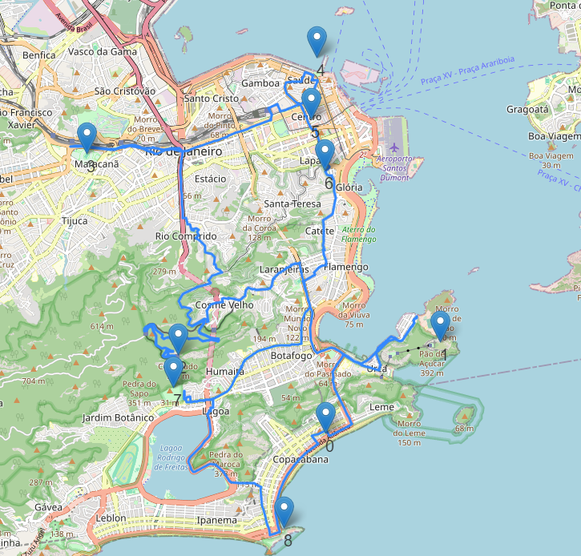

# U3T1
## Componentes: Emanoel Batista Pereira Filho, Ivamar Dantas Roque, Paulo Ricardo Dantas

Foram disponibilizados vários projetos para a terceira unidade. A tarefa que a gente escolheu foi a de usar o Osmnx para escolher pontos turísticos de uma cidade e usar um algoritmo para achar o menor caminho entre esses pontos. A seguir vão ser descritos alguns resquisitos necessários para o trabalho:

- Seleção da Cidade e Pontos Turísticos
- Implementação do Algoritmo de Simulated Annealing
- Desenvolvimento de uma Interface de Usuário baseada no Folium e Osmnx
- Simulação e Teste de Roteiros
- Visualização do Roteiro

### Biblioteca OSMNX

O OSMnx (OpenStreetMap and NetworkX) é uma biblioteca Python que facilita a recuperação, a modelagem e a visualização de dados de redes urbanas a partir do OpenStreetMap (OSM). Ele é construído sobre a biblioteca NetworkX, que é usada para manipular estruturas de dados de grafo em Python.

Aqui estão os passos básicos de como o OSMnx funciona:

- **Download de dados OSM:**
O OSMnx permite que você baixe dados de ruas, redes de transporte público e outros elementos urbanos diretamente do OpenStreetMap.
Você pode fornecer coordenadas geográficas ou um nome de lugar (como uma cidade) para extrair os dados.

- **Criação de Grafos:**
O OSMnx converte os dados OSM em um grafo direcionado ponderado, onde os nós representam interseções ou pontos de interesse, e as arestas representam ruas ou caminhos entre esses nós.
As características das ruas, como comprimento, tipo de rua e direção, são atribuídas às arestas.

- **Análise do Grafo:**
Uma vez criado o grafo, você pode realizar várias análises, como encontrar o caminho mais curto entre dois pontos, calcular a centralidade dos nós, identificar ciclos, entre outros.
O OSMnx fornece uma variedade de funções para analisar e visualizar características do grafo.

- **Visualização:**
O OSMnx oferece ferramentas para visualizar graficamente a rede urbana que você extraiu do OSM.
Você pode gerar mapas que mostram a topologia da rede, a distribuição de tipos de ruas, a conectividade entre diferentes partes da cidade, entre outras informações.

### Simulated Annealing Algorithm

O algoritmo Simulated Annealing é uma técnica de otimização probabilística inspirada no processo físico do recozimento simulado de metais. É usado para resolver problemas de otimização global onde se busca encontrar o melhor estado (ou solução) em um espaço de busca grande e complexo.

**Funcionamento:**
1. **Inicialização**: Começa com uma solução inicial para o problema.
2. **Geração de Vizinhança**: Gera uma solução vizinha, mudando-a de forma aleatória.
3. **Avaliação de Energia**: Calcula uma função de custo para a solução.
4. **Aceitação Probabilística**: Decide se a solução vizinha é aceita com base em uma probabilidade, mesmo que seja pior que a solução atual.
5. **Repetição**: Repete os passos 2 a 4 por um número de iterações ou até que uma condição de parada seja atingida.
6. **Resfriamento**: Reduz a probabilidade de aceitar soluções piores ao longo do tempo.

O Simulated Annealing é aplicado em problemas de otimização combinatorial, como o problema do caixeiro viajante, design de circuitos, entre outros, onde encontrar a solução global é desafiador.

# Resolução do trabalho

Para fazer o uso desse repositório a motivação foi a seguinte. Um turista está hospedado no Copacabana Palace, no Rio de Janeiro, e ele quer visitar os seguintes pontos turísticos em um único dia:
- Pão de Açúcar
- Cristo Redentor
- Museu do Amanhã
- Maracanã
- Parque Lage
- Escadaria Selarón
- Real Gabinete Português
- Forte de Copacabana

OBS: Os pontos foram escolhidos aleatoriamente e também podem ser modificados.

Pensando nisso, foi elaborado um programa que dado os pontos acima, traçasse a melhor rota saindo do Copacabana Palace, passando por cada ponto turístico uma vez e voltando para o Copacabana Palace no final. O algoritmo vai procurar qual a menor distância percorrida passando por todos os pontos. Para encontrar o melhor caminho, foi usado o algoritmo Simulated Annealing.

O programa foi desenvolvido no colab e está disponivel nesse [link](https://github.com/rikdantas/Algoritmos-Estruturas-Dados-II/blob/main/U3T1/source/U3T1.ipynb). Os resultados do notebook foram baixados e estão disponíveis na pasta [results](https://github.com/rikdantas/Algoritmos-Estruturas-Dados-II/tree/main/U3T1/results) desse repositório. Para exemplificar iremos deixar alguma imagens do resultados no decorrer do README.

## Pontos no mapa

Na imagem acima podemos ver a saída do mapa da biblioteca OSMNX com os pontos marcados no mapa.

## Rota otimizada

O algoritmo resultou na seguinte sequência para visitação dos pontos: Pão de açúcar, Cristo Redentor, Maracanã, Museu do amanhã, Real Gabinete Português, Escadaria Selarón, Parque Lage e por último o Forte de Copacabana. A rota totalalizou **58.77 km**. Note que o algoritmo encontra o menor caminho, como não é considerado o trânsito, o menor caminho pode não ser o mais rápido, mas vai ser o mais curto.

# Referências

Os códigos usados no nosso estudo de caso estão disponíveis no github do finlandês Ossi Myllymäki, mais especificamente nesse [repositório](https://github.com/omyllymaki/conquering-seven-hills/tree/main).